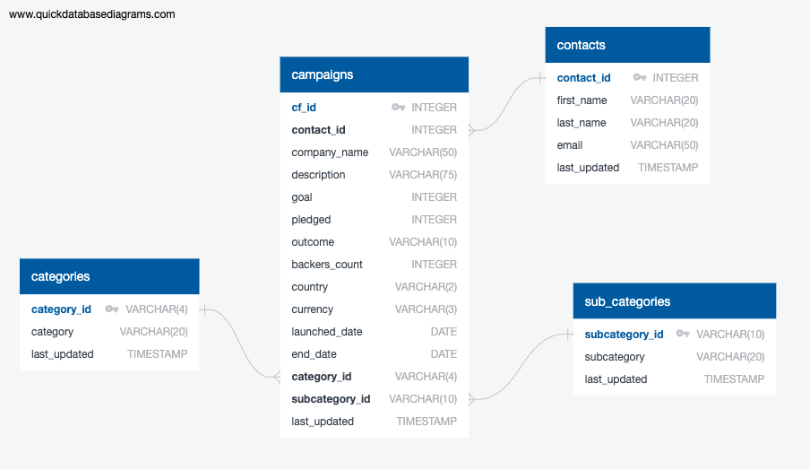

# project-2-group-20

Project 2 - Extract, Transform, Load

## Background

This project attempts to model a basic Extract, Transform, Load (ETL) data pipeline using generated crowdfunding data. We used Excel workbooks to extract data, but this could just as easily be data from a data lake, warehouse, or any other data source. Then, the data was normalized (Transformed) to work in a `PostgreSQL` database. Finally, the normalized data was loaded into the database so it could be queried using `SQLAlchemy`.

## [Set-Up](load/create_db/)

This project uses a local `PostgreSQL` server to store the database. Make sure the server and database exist and the [schema](load/create_db/schema.sql) has been set up using the query tool in PgAdmin. If a remote server is being used, or the default username and password do not apply to you, then you will need to adjust these values in each notebook.

The database looks like this:

## [Extract/Transform](transform/ETL_Mini_Project.ipynb)

The Excel workbooks were loaded into `Pandas DataFrames` to handle the normalization. `Pandas` makes it easy to manipulate datatypes, create new columns, and build new tables. With the two workbooks, four tables were created to store the data in a relational database. These four tables were exported as CSVs to make loading the data into the database easier and separate the loading from the extraction.

## [Load](load/load_data/load_data.ipynb)

We connected to the database using `SQLAlchemy` and then read in the CSVs using `Pandas`. Then, `Pandas` trivialized loading the data into the database using the `{data_frame}.to_sql()` function. The `to_sql()` function turns each `DataFrame` into rows that can be added to a table in the database (provided the datatypes and formatting match the existing database schema).

This step can also be completed using the PgAdmin GUI.

## [Query](query/queries.ipynb)

In this step, a sample Exploratory Data Analysis (EDA) was completed to show examples of querying a database using `SQLAlchemy`. We found that "Theater" had the highest number of campaigns with 344 whereas "Journalism" had the lowest number of campaigns with 4. Within Theater, "Plays" had the highest success with campaigns followed by "Rock" music. The subcategories with the lowest success rate were mobile games, audio, metal music, radio/podcasts, and world music.
